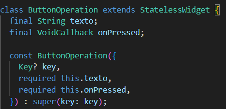
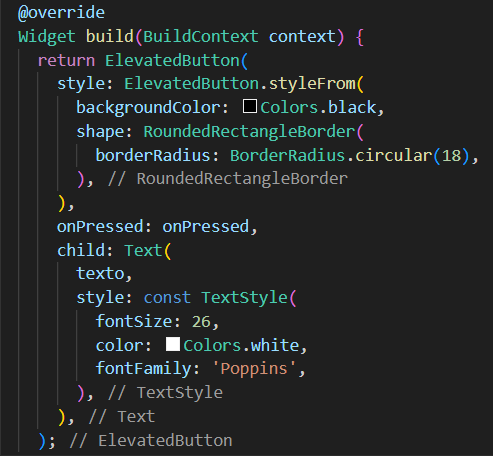
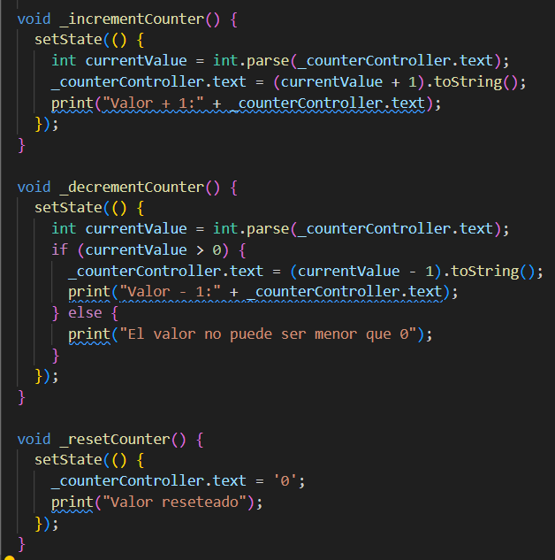
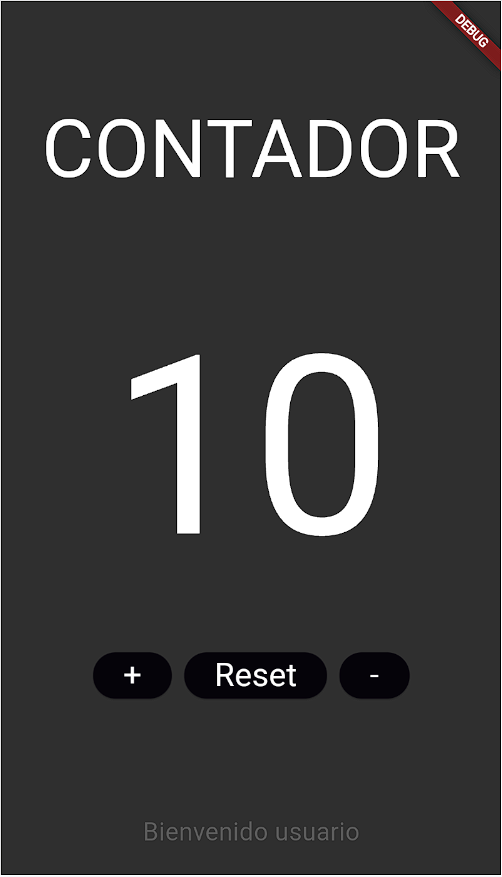
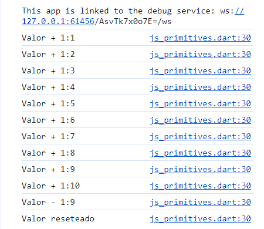

# brunrodrigueza02

## EJERCICIO 02

Crea un nuevo PROYECTO y crea el contador que creamos en android(sin funcionalidad por ahora).

## Comentario

* Se ha creado un nuevo proyecto brunrodrigueza02 junto a un nuevo repositorio BrunRodriguezA02
* Se ha creado una copia del fragment_contador.xml del proyecto en Android Studio
    Esta ventana contiene los siguientes elemntos:
  
- Un widget Column que dispone los elementos hijos verticalmente.
- Un widget Expande que distribuye todos los elementos según la capacidad máxima de la pantalla.
- Un widget Text Contador.
- Un widget SizedBox que contiene un Text con el número 0.
- Un widget SizedBox que contiene una fila para disponer tres widgets ElevatedButton horizontalmente.
- Un widget SizeBox que contiene un Text con la cadena "Bienvenido usuario".

* En esta entrega solo se han creado los elemntos visuales de la aplicación. La lógica se creará en entregas posteriores.

## EJERCICIO 03

- Deberás de crear una clase en flutter que sea una plantilla de los botones, en la que le pases el argumento de texto y sustituirlo por los 3 botones que tenemos → 2 puntos
- Darle funcionalidad a los botones, cambios solo por consola → 2 puntos
- Cambios por pantalla → 4 puntos.
- README → 2 puntos.

## Comentario

* Se ha creado un packete widgets y en la misma una clase btn_operation.dart.
- Este boton remplaza las instancias de ElevatedButton anteriores.
- El boton incluye un atributo texto (String) y una funcion VoidCallback con la que se llama a los distintos metodos según corresponda:

* Se ha alterado la clase MyApp para que extienda a StatefulWidget en vez de StatelessWidget.
- Esto nos permite alterar el valor del widget Text de contador mientras la aplicación esta en ejecución.
* Se han creado 3 métodos para aumentar, disminuir y resetear el contador.
- Estos métodos alteran el valor del texto de contador y a su vez imprimen el resultado de las operaciones por consola:

* Los resultados se muestran tanto por pantalla como por consola.

