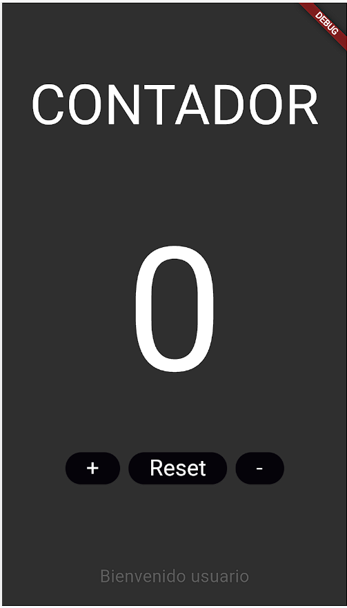

# brunrodrigueza02

## EJERCICIO 02

Crea un nuevo PROYECTO y crea el contador que creamos en android(sin funcionalidad por ahora).

## Comentario

* Se ha creado un nuevo proyecto brunrodrigueza02 junto a un nuevo repositorio BrunRodriguezA02
* Se ha creado una copia del fragment_contador.xml del proyecto en Android Studio
    Esta ventana contiene los siguientes elemntos:
  
- Un widget Column que dispone los elementos hijos verticalmente.
- Un widget Expande que distribuye todos los elementos según la capacidad máxima de la pantalla.
- Un widget Text Contador.
- Un widget SizedBox que contiene un Text con el número 0.
- Un widget SizedBox que contiene una fila para disponer tres widgets ElevatedButton horizontalmente.
- Un widget SizeBox que contiene un Text con la cadena "Bienvenido usuario".

* En esta entrega solo se han creado los elemntos visuales de la aplicación. La lógica se creará en entregas posteriores.
